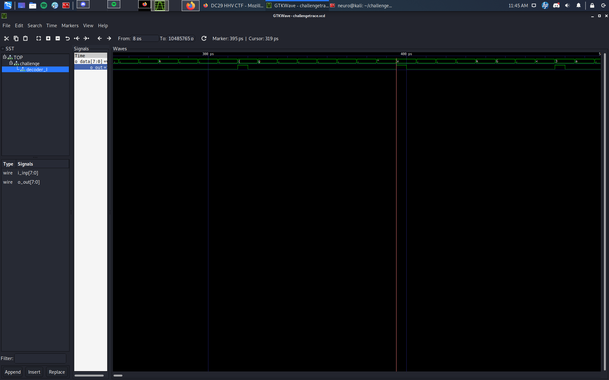
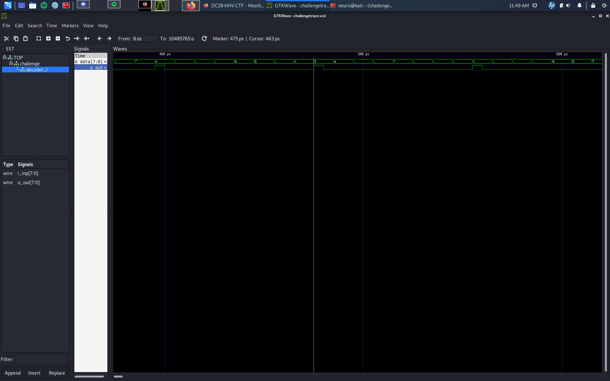
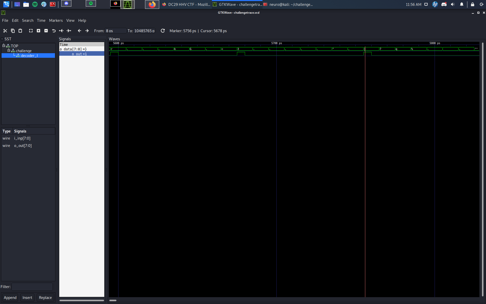
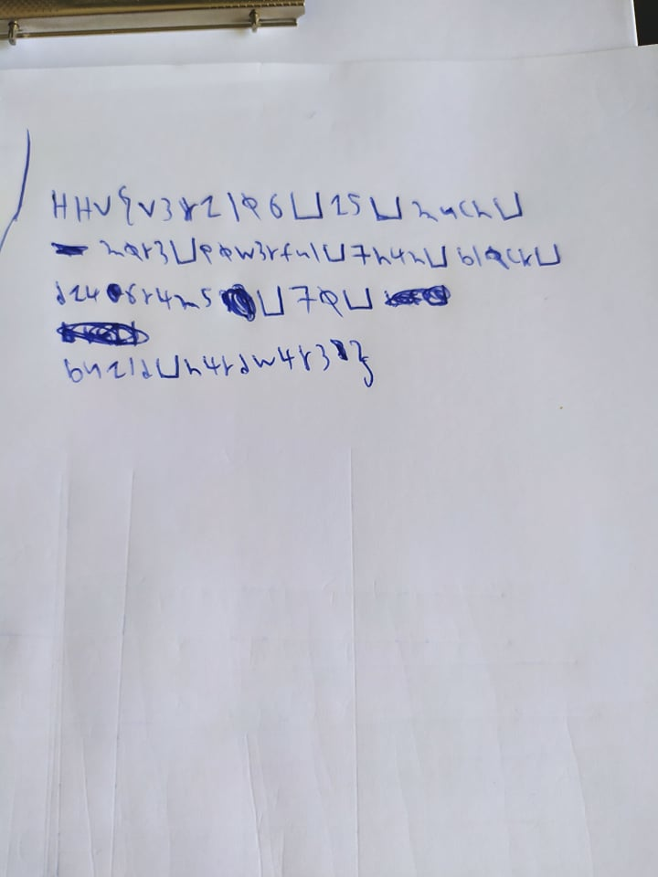

# Author:

# Challenge name:

We use make and then open the ```challengetrace.vcd ``` file on <code>GTKWave</code>

And we pull to analyse the ``` o data[7:0] ``` and ``` o out ``` from the challenge tab

From the following samples we see that we the ``` o out `` has a rising edge the ```o data ``` reveals a letter from the Flag







So I wrote the flag by hand following the power trace and got:



We change spaces to '_' and get the flag

## Flag: ##
```HHV{v3r1l06_15_much_m0r3_p0w3rful_7h4n_bl0ck_d146r4m5_70_bu1ld_h4rdw4r3}```
