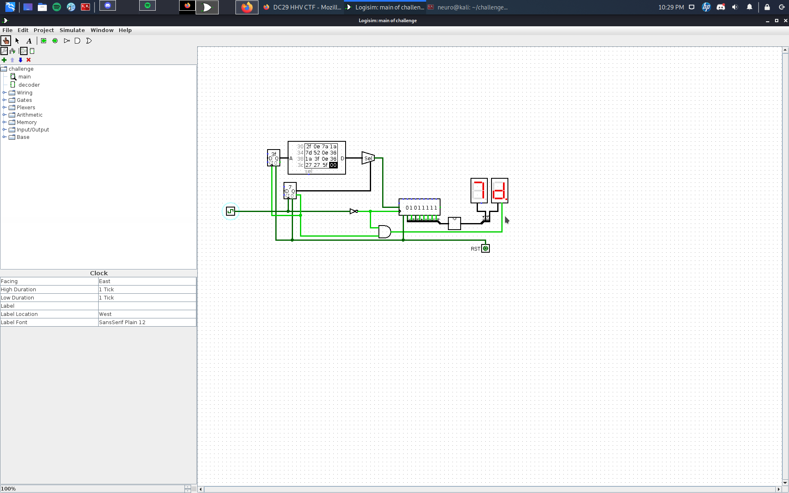

# Author:

# Challenge name:

# Solution:

We open the ```.circ``` file in ```logisim```

Now we caneither script everything or go manually if we go manually we just have to observe wich output has the and gate being 1 and at the same time the 7 segment display takes input directly from the and gate(logical 1)

We can also observe that every 8 values comes on value from the flag



We get a hex flag:

```
48 48 56 7b 62 6c 30 63 6b 5f 64 31 34 36 72 34 6d 35 5f 34 72 33 5f 37 68 33 5f 33 34 35 31 33 35 37 5f 77 34 79 5f 37 30 5f 75 6e 64 33 72 35 37 34 6e 64 5f 68 34 72 64 77 34 72 33 33 7d
```

## Flag: ##

```HHV{bl0ck_d146r4m5_4r3_7h3_3451357_w4y_70_und3r574nd_h4rdw4r33}```
