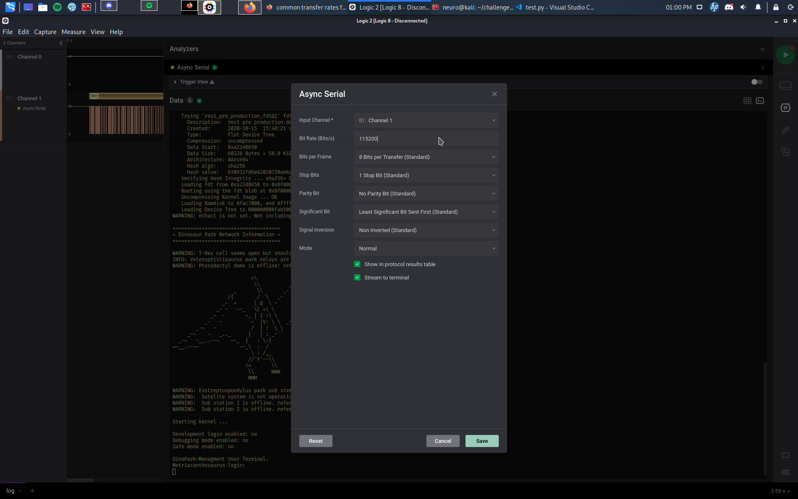
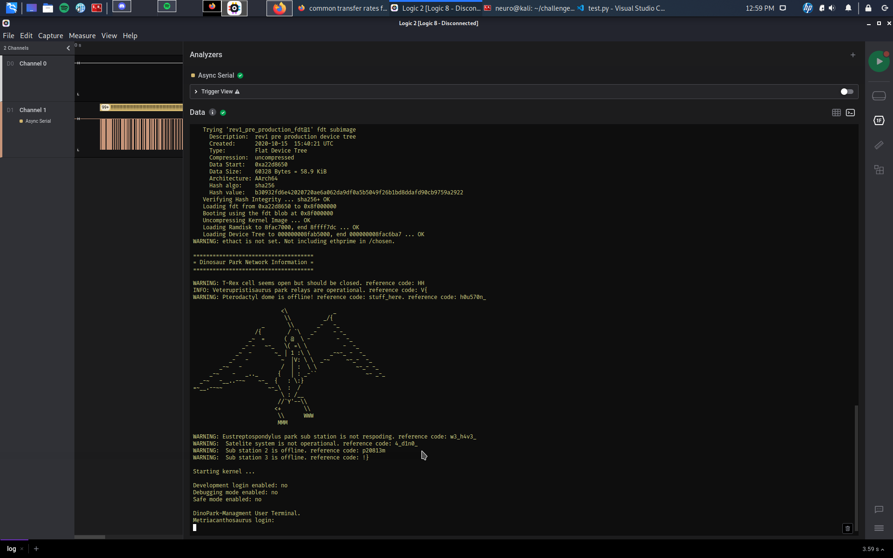

# Author:

# Challenge name:

# Solution:

We open the ```.sal``` file and add an async serial with the default config

At first glance we think that everything is ok because we have a decoded output but some characters are just nonsense so we start to edit the async serial settings to change the transmission rate to some common rates and get the flag:





## Flag: ##
```HHV{h0u570n_w3_h4v3_4_d1n0_p20813m!}```
