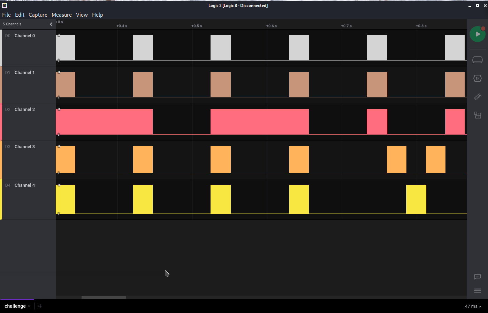
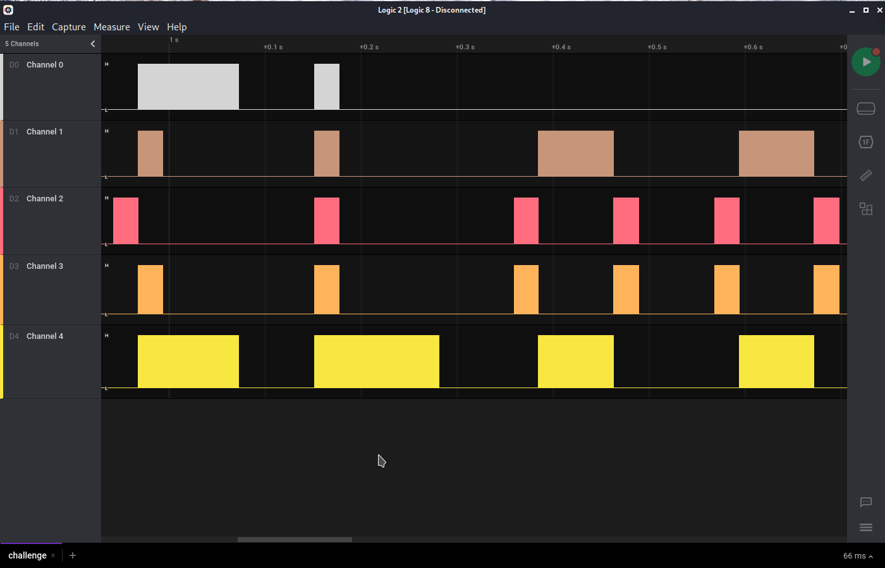
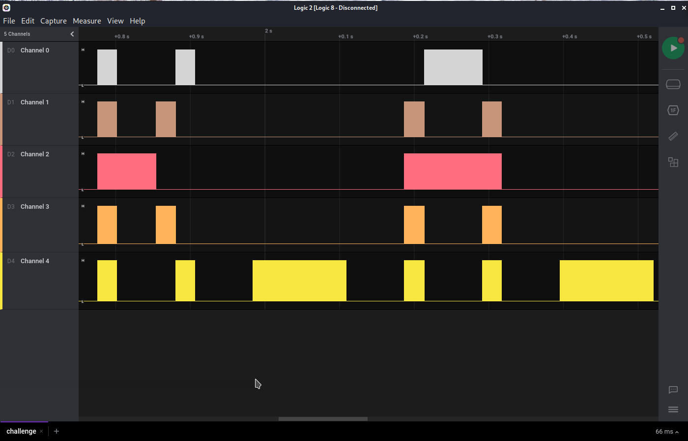
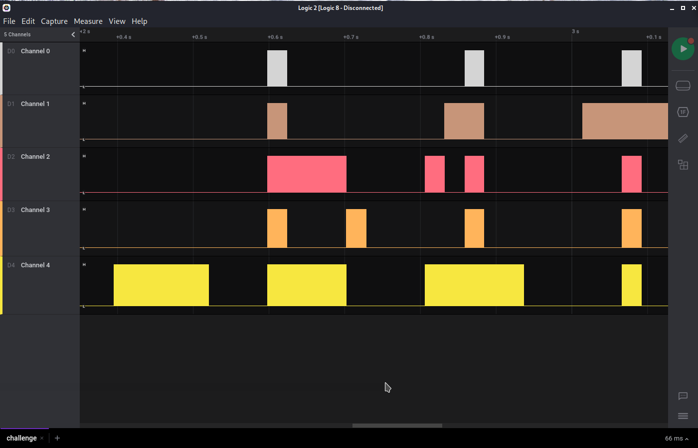
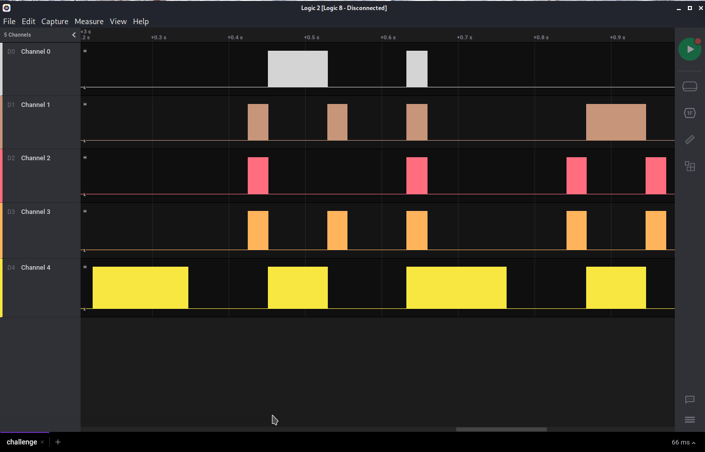
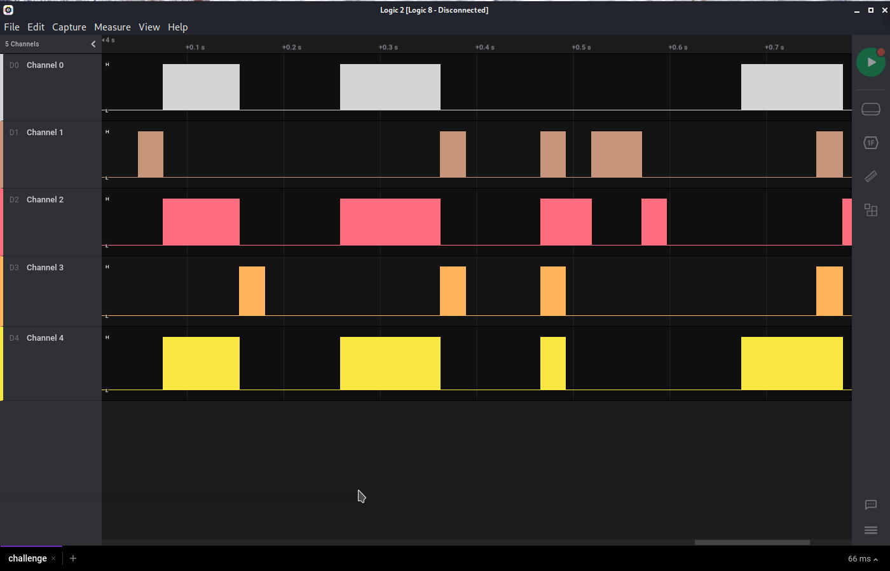

# Author:

# Challenge name:

## Solution: ##

We have to open the file in saleae and play with the zoom of the waveform and get:













And for the last part we brute force the not clear characters such as:

o,0,5,s,S

## Flag: ##

``` HHV{LooK_A_b1t_CLoS3r}```
