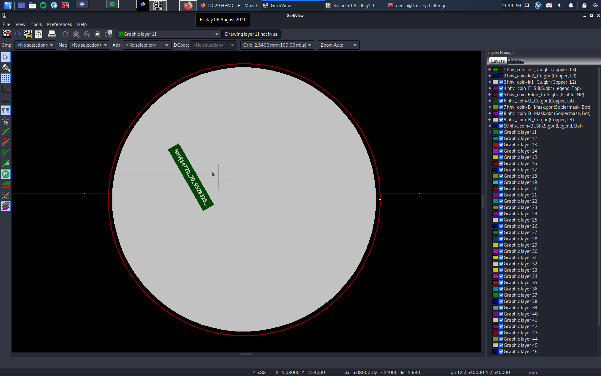
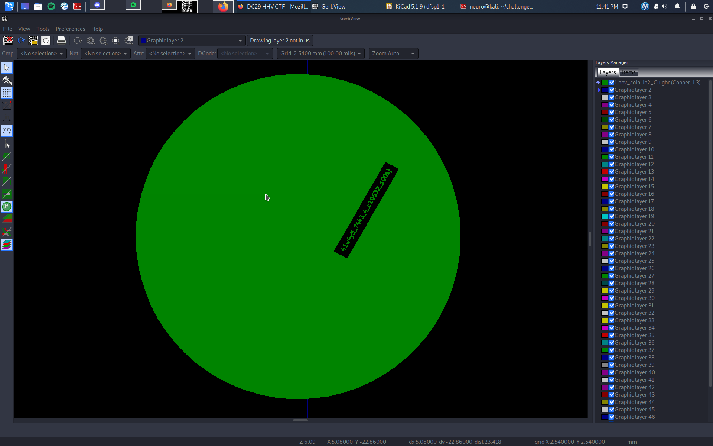
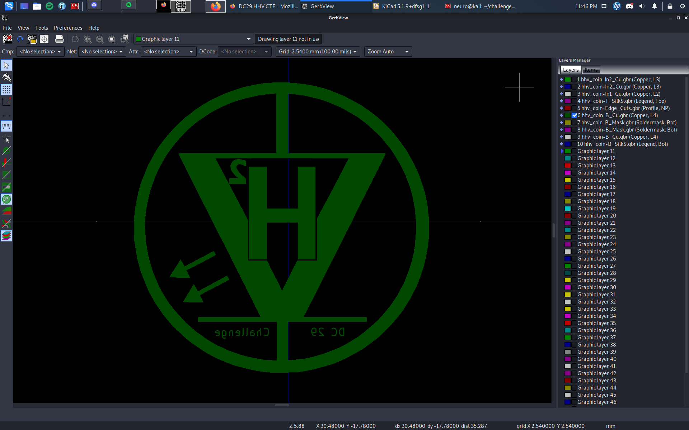

# Author: Panagiotis Fiskilis/Neuro

# Challenge name: Defcon 29 HHV: Secret Board

Lore:

```
We obtained the fabrication files of a secret printed circuit board but we don't know how to open them! Can you help us?
```

# Solution:

From the file names we can find that they are KiCad files

We start by opening them one by one using the ```gbr view``` 

When we play with the visibility of each layer we find the 2 part flag:





And finnaly we set all layers to non-visible and get the DC-29-HVV logo:



## Flag: ##

HHV{1n720_70_9328325_41w4y5_74k3_4_c10532_100k}
